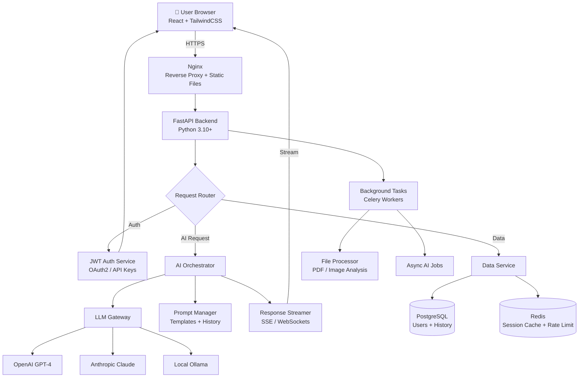

# 🌐 AI Web App

A full-stack AI-powered web application featuring a modern React frontend and a FastAPI backend, integrating large language models for intelligent conversational features, content generation, and data analysis.

## 🏗️ Architecture



## ✨ Features

- Streaming chat interface with real-time AI responses
- Multi-provider LLM support (OpenAI, Claude, local Ollama)
- User authentication with JWT + OAuth2 (Google, GitHub)
- Conversation history with full persistence
- File upload and AI-powered analysis (PDF, images)
- Rate limiting and usage tracking
- Responsive mobile-first design
- Dark/light mode
- REST API with OpenAPI docs

## 🛠️ Tech Stack

| Layer | Technology |
|-------|-----------|
| Frontend | React 18, TailwindCSS, Zustand |
| Backend | FastAPI, Python 3.10+ |
| LLM APIs | OpenAI, Anthropic, Ollama |
| Database | PostgreSQL + SQLAlchemy |
| Cache | Redis |
| Auth | JWT, OAuth2 |
| Task Queue | Celery |
| Proxy | Nginx |
| Deployment | Docker Compose |

## 🚀 How to Run

```bash
# 1. Clone repository
git clone https://github.com/jadfarhat-cell/ai-web-app.git
cd ai-web-app

# 2. Configure environment
cp .env.example .env
# Edit .env: add OPENAI_API_KEY, DATABASE_URL, SECRET_KEY, etc.

# 3. Start all services with Docker Compose
docker-compose up -d

# 4. Or run manually:
# Backend
pip install -r backend/requirements.txt
uvicorn backend.main:app --reload --port 8000

# Frontend
cd frontend && npm install && npm run dev

# 5. Access the app
# Frontend: http://localhost:3000
# API Docs: http://localhost:8000/docs
```

## 📁 Project Structure

```
ai-web-app/
├── backend/
│   ├── main.py             # FastAPI app + routes
│   ├── auth/               # JWT + OAuth handlers
│   ├── ai/
│   │   ├── orchestrator.py # LLM routing logic
│   │   ├── openai_client.py
│   │   ├── claude_client.py
│   │   └── prompts/        # Prompt templates
│   ├── models/             # SQLAlchemy models
│   ├── tasks/              # Celery background tasks
│   └── requirements.txt
├── frontend/
│   ├── src/
│   │   ├── components/     # React components
│   │   ├── pages/          # Route pages
│   │   ├── store/          # Zustand state
│   │   └── api/            # API client
│   └── package.json
├── docker-compose.yml
├── nginx.conf
└── .env.example
```
